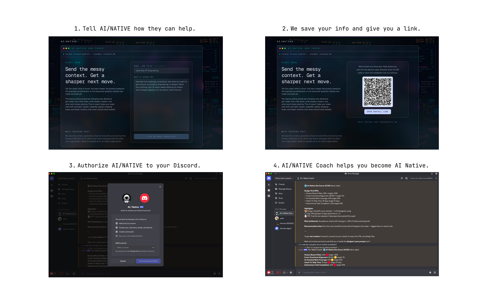

# AI-native executive coach (Discord-first)



Execs fill a short **take-in form** on the Next.js site; then they scan a **QR code** (Discord OAuth with guild/server install context). After Discord redirects back, their Discord account is **linked** to a prefilled `sessions` row (problem text + playbook picks). They **DM the bot** and coaching continues from that context — **no extra signup**.

Anyone who skips the web flow can still **authorize Discord manually** and **DM with ≥ 20 characters** to seed a session the original way.

**Stack:** Next.js landing · Supabase Postgres + Drizzle · OpenRouter (LLM) · `discord.js` gateway on **Railway**.

## Monorepo layout

| Path | Role |
|------|------|
| `app/` | Landing + intake form, OAuth callback (`/api/discord/callback`), `/api/intake` |
| `bot/src/main.ts` | Gateway: creates `sessions` row on first DM, coach loop, `/skills`, `/reset` |
| `lib/` | DB client, skills loader + router, prompts, coach + memory compression |
| `content/skills/` | Markdown playbooks (frontmatter + body) |
| `scripts/register-commands.ts` | Registers global slash commands |
| [`railway.toml`](railway.toml) | **Discord bot** on Railway — install-only build, `npm run bot` start |

## Prerequisites

- Node **20+**
- [Discord application](https://discord.com/developers/applications) with a **bot user**
- [Supabase](https://supabase.com/) project (Postgres) — **required for the bot** and for **take-in → OAuth linking** on the Next app
- [OpenRouter](https://openrouter.ai/) API key on the **bot** host

## 1. Supabase / database

1. Create a project → **Connect** (or **Settings → Database**).  
2. Use the **Transaction pooler** URI (port **6543**) as `DATABASE_URL` for the **bot** (and for `drizzle-kit` from your laptop).  
3. Optionally set `DIRECT_URL` (direct / session, port **5432**) if `drizzle-kit push` fails against the pooler.

Apply schema:

```bash
cp .env.example .env.local
# fill DATABASE_URL (and DIRECT_URL if needed)

npm run db:push
```

## 2. Discord application

1. **Bot** tab: enable **MESSAGE CONTENT INTENT** (privileged). Copy **token** → `DISCORD_BOT_TOKEN` (bot host only). You typically **don’t** need **SERVER MEMBERS INTENT**. The gateway also opts into **`Guilds`** so that if someone installs the app **into a server**, the bot can post **one short hello** in that server’s **system channel** when it has **Send Messages** there. Discord’s gray lines (“X hopped into the server”) are **system messages**, not your bot speaking—you’re adding an explicit bot message next to that moment when installs flow includes **guild** installs.  
2. **Installation** → enable **Guild Install** for the QR flow (and optionally **User Install** for DM-only installs). Configure default install settings with `bot` + `applications.commands` for guild installs.  
3. **General** → copy **Application ID** → `DISCORD_APPLICATION_ID`.  
4. **OAuth2 → General** → copy **Client ID** → `DISCORD_CLIENT_ID` and **Client Secret** → `DISCORD_CLIENT_SECRET`. Under **Redirects**, add your callback URL **exactly** (e.g. `http://localhost:8888/api/discord/callback` locally, or `https://your-domain.com/api/discord/callback` in prod). You can override with `DISCORD_REDIRECT_URI` if it must differ from `{APP_URL}/api/discord/callback`.  
5. **Interactions Endpoint URL:** leave **blank** — slash commands are handled on the **gateway** via `INTERACTION_CREATE`.  
6. Register slash commands **once** (and after command changes):

```bash
DISCORD_BOT_TOKEN=... DISCORD_APPLICATION_ID=... npm run register-commands
```

Global commands may take up to an hour to propagate.

### Coaching flow (happy path)

1. User submits the **take-in form** → Next creates a `sessions` row (`problem`, `relevant_skill_slugs`) with `discord_user_id` **null**, then shows a **QR** encoding Discord OAuth (`integration_type=0`, `bot applications.commands identify`, `state` = session id).  
2. User completes Discord authorize → `/api/discord/callback` exchanges the code, reads `@me`, and sets `discord_user_id` on that session (merging into an existing session if they already had one).  
3. User DMs the bot; the bot finds the existing session and runs the coach. `/reset` clears DM history; `/skills` lists injected playbooks.

### Coaching flow (Discord-only fallback)

1. User installs the app without the web form (any valid user-install authorize URL).  
2. First DM with **≥ 20 characters** creates `sessions` tied to their Discord id as before.

## 3. Environment variables

See [`.env.example`](.env.example).

**Web host (Vercel / Railway / Node)**

- `DATABASE_URL` — required for intake + OAuth linking (same Supabase DB as the bot).  
- `DISCORD_CLIENT_ID`, `DISCORD_CLIENT_SECRET` — OAuth code flow + QR authorize URL.  
- `APP_URL` — public origin used to build `DISCORD_REDIRECT_URI` when unset (must match the Redirect you configured in Discord).  
- Optional: `DISCORD_REDIRECT_URI` — full callback URL if it cannot be derived from `APP_URL`.

**Bot (Railway or local)**

- `DATABASE_URL` — Supabase pooler  
- `DISCORD_BOT_TOKEN`  
- `OPENROUTER_API_KEY`  
- Optional: `OPENROUTER_COACH_MODEL` (default `anthropic/claude-sonnet-4.6`)  
- Optional: `OPENROUTER_SUMMARY_MODEL` (default `google/gemini-2.5-flash`)  
- Optional: `OPENROUTER_APP_NAME`, `OPENROUTER_APP_URL` (`APP_URL` used as fallback for OpenRouter referrer)

## 4. Local development

```bash
npm install
npm run db:push
npm run dev
```

The site is at **http://localhost:8888** (`package.json` pins the dev port). Set `DATABASE_URL`, `DISCORD_CLIENT_ID`, `DISCORD_CLIENT_SECRET`, and `APP_URL=http://localhost:8888` in `.env.local`, and add `http://localhost:8888/api/discord/callback` under Discord → OAuth2 → Redirects.

In another terminal, with the **same** env as Next (e.g. `.env.local` at the repo root — the bot loads `.env` then `.env.local`):

```bash
npm run bot
```

## 5. Deploy

### Discord bot on Railway (recommended)

[`railway.toml`](railway.toml): **build** `npm ci`, **start** `npm run bot`.

1. New project → GitHub → this repo.  
2. **Variables** → bot env from [§3](#3-environment-variables).  
3. Optional **Watch paths:** `bot/`, `lib/`, `content/skills/`, `package.json`, `railway.toml`.

### Optional: Next.js on Railway or Vercel

Second service (or Vercel): `npm run build` / `npm run start`. Set **`DATABASE_URL`**, **`DISCORD_CLIENT_ID`**, **`DISCORD_CLIENT_SECRET`**, **`APP_URL`** (production URL), and register **`{APP_URL}/api/discord/callback`** as a Discord OAuth redirect.

### After deploy

Run `npm run register-commands` when slash definitions change.

## Scripts

| Script | Purpose |
|--------|---------|
| `npm run dev` | Next.js dev server |
| `npm run build` / `npm run start` | Production web |
| `npm run bot` | Discord gateway |
| `npm run db:push` | Apply Drizzle schema to Postgres |
| `npm run register-commands` | Push `/skills` and `/reset` to Discord |

## License

Private / unlicensed unless you add one.
